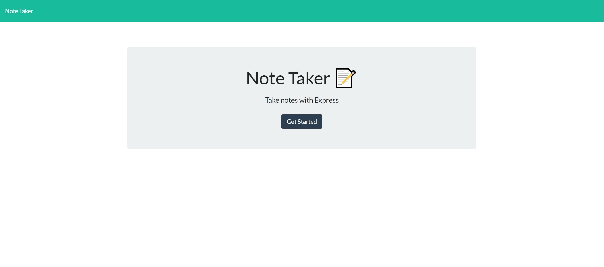
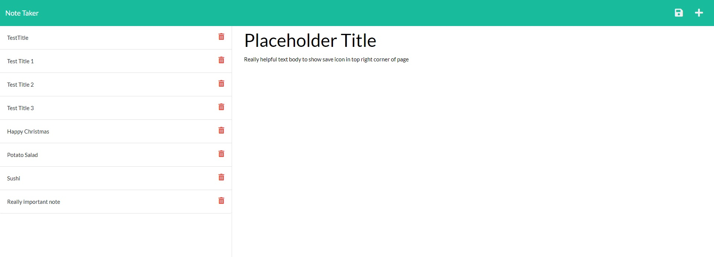
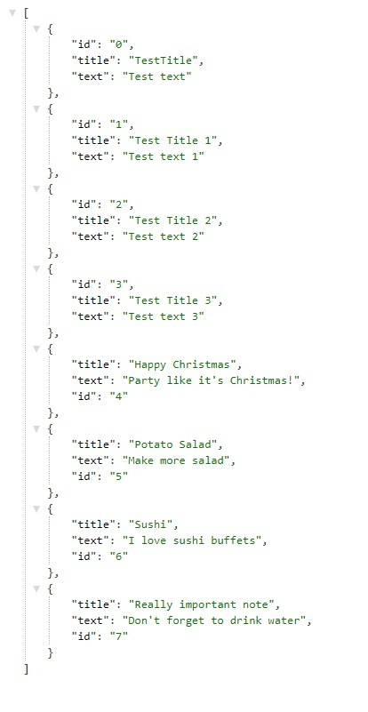

# Note Taker Starter Code
The purpose of this challenge is to design a backend server using Express.js that allows a user to perform CRUD operations on notes. Note data stored as JSON file and application hosted on Heroku.

## Table of Contents
* [Criteria](#criteria)
* [Tools used](#tools-used)
* [Contributions](#contributions)
* [Final Result](#final-result)

## Criteria
* Landing page with link to notes page
    * Leads to page with existing notes listed on left-column of page
    * Empty fields for new note and title on right-column
* Save icon appears when new note title and text entered
    * If save clicked, note stored/moved to left-column
* Clicking on stored note populates the information into right-column
* Write icon allows user to enter a new note and title

### Tools Used
* Express.js
* Heroku (hosting)

## Contributions
Designed and written by Tony Huang

## Final Result
Main landing page

Stored notes and entry field

Sample JSON data
